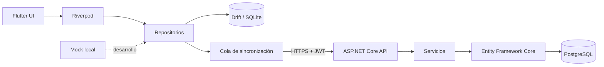
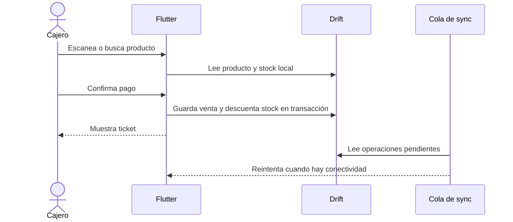
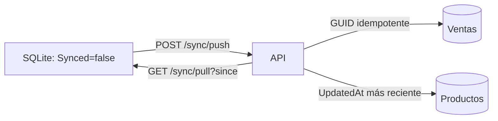

# Diagramas iniciales

## Arquitectura

```mermaid
flowchart LR
    UI[Flutter UI] --> State[Riverpod]
    State --> Repo[Repositorios]
    Repo --> Local[(Drift / SQLite)]
    Repo --> Queue[Cola de sincronización]
    Queue -->|HTTPS + JWT| API[ASP.NET Core API]
    API --> Services[Servicios]
    Services --> EF[Entity Framework Core]
    EF --> DB[(PostgreSQL)]
    Mock[Mock local] -. desarrollo .-> Repo
```

## Flujo de venta

```mermaid
sequenceDiagram
    actor Cajero
    participant App as Flutter
    participant DB as Drift
    participant Sync as Cola de sync
    Cajero->>App: Escanea o busca producto
    App->>DB: Lee producto y stock local
    Cajero->>App: Confirma pago
    App->>DB: Guarda venta y descuenta stock en transacción
    App-->>Cajero: Muestra ticket
    Sync->>DB: Lee operaciones pendientes
    Sync-->>App: Reintenta cuando hay conectividad
```

## Sincronización

```mermaid
flowchart LR
    Local[SQLite: Synced=false] -->|POST /sync/push| API[API]
    API -->|GUID idempotente| Sales[(Ventas)]
    API -->|UpdatedAt más reciente| Products[(Productos)]
    API -->|GET /sync/pull?since| Local
```
